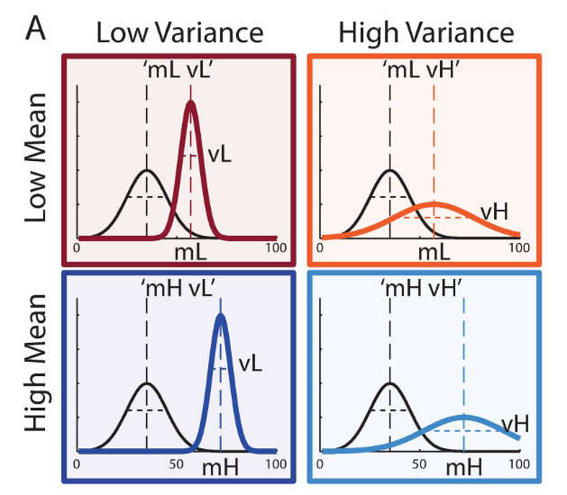
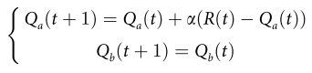
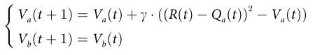

# BanditConf
Modeling choice and confidence in reinforcement learning (restless bandits) with Gaussian-distributed payoffs.
## Dataset 
 The data are those used by [Hertz et al (2018)](https://journals.plos.org/plosone/article?id=10.1371/journal.pone.0195399).

The experiment consists on a non-stationary two-armed bandit task. At each trial, participants are presented with two doors, and are asked to choose one of them to sample a reward from and indicate their level of confidence (1 to 6) as below:

The options give rewards sampled from Gaussian distributions that change without warning over the experiment. In experiment 1, one option is often better than the other (M = 65 vs M = 35). An option can have low or high SD (10 or 25 respectively), giving 4 possible conditions (actually more, but not reported) based on the combinations:

Since they observed participants seem to take into account only the SD of the good option, they carry out a second experiment where the distribution of the bad option is kept constant (M = 35, SD = 10) accross conditions, and instead they vary the SD and mean of the good option, giving the following conditions.

           

## Modeling

Here I test several Q-learning models to explain choice and confidence. As in some of Hertz's models, I assume learning about the mean and variance:

Where Q is the trial-by-treal belief about the mean of each option

Where V is the trial-by-treal belief about the variance of each option

In principle I assume choice and confidence based on [Thompson sampling (Thompson, 1933)](https://www.dropbox.com/s/yhn9prnr5bz0156/1933-thompson.pdf), i.e. the probability of choosing option A matches the probability that A it gives a higher reward than B. 

I compare an unbiased learning model with models that learn differently for positive and negative surprises (prediction errors), in the spirit of previous computational models of optimistic learning ([Lefebvre et al 2017](https://www.nature.com/articles/s41562-017-0067)). 

In particular, I test a model that learn differently for positive or negative reward prediction errors (  )
, having either: 
- different learning rates about the mean (alpha) 
- different learning rates about the variance (gamma)
- different learning rates about both the mean and the variance 

<!---
[comment]: #(![f1] use something like this to insert formulas)
[f1]: http://chart.apis.google.com/chart?cht=tx&chl=\alpha
---!>
