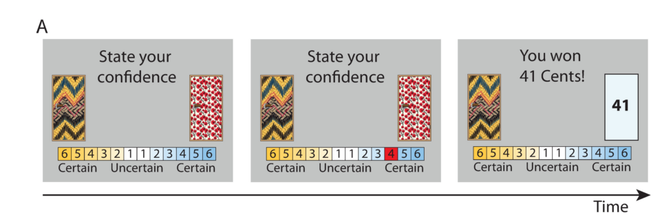
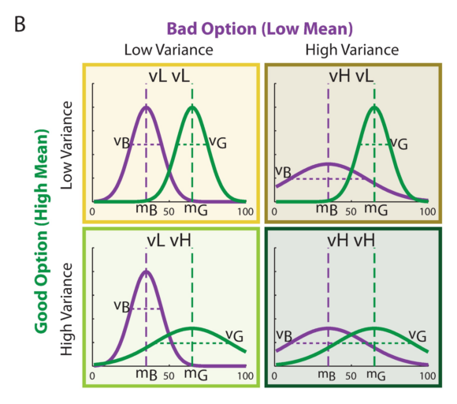

# BanditConf
Modeling choice and confidence in reinforcement learning (restless bandits) with Gaussian-distributed payoffs. The data are those used by [Hertz et al (2018)](https://journals.plos.org/plosone/article?id=10.1371/journal.pone.0195399)

The experiment consists on a non-stationary two-armed bandit task. At each trial, participants are presented with two doors, and are asked to choose one of them to sample a reward from and indicate their level of confidence (1 to 6) as below:

The options give rewards sampled from Gaussian distributions that change without warning over the experiment. In experiment 1, one option is often better than the other (M = 65 vs M = 35). An option can have low or high variance (10 or 25 respectively), giving 4 possible conditions (actually more, but not reported) based on the combinations:

<!---
[comment]: #(![f1] use something like this to insert formulas)
[f1]: http://chart.apis.google.com/chart?cht=tx&chl=\alpha
