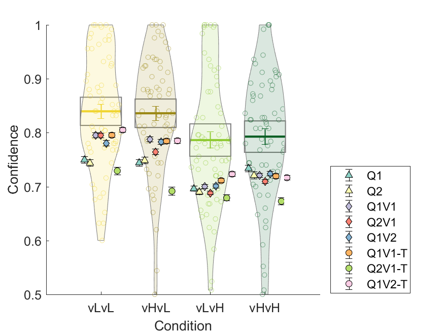
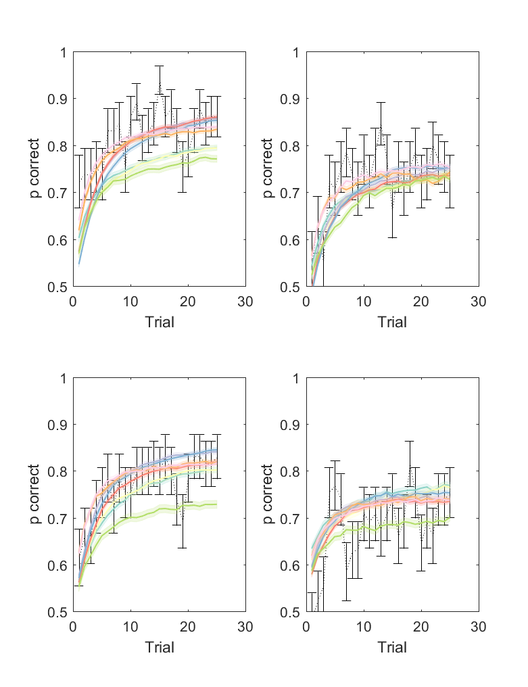

# BanditConf
Modeling choice and confidence in reinforcement learning (restless bandits) with Gaussian-distributed payoffs.

### Matlab version and dependencies
This code was tested in Matlab versions 2017b and 2018b. Parts of it require Matlab's statistics toolbox and optimization toolbox. Bayesian model comparison requires VBA toolbox.

## Dataset 
 The data are those used by [Hertz et al (2018)](https://journals.plos.org/plosone/article?id=10.1371/journal.pone.0195399) in experiment 1.

The experiment consists on a non-stationary two-armed bandit task. At each trial, participants are presented with two doors, and are asked to choose one of them to sample a reward from and indicate their level of confidence (1 to 6) as below:

The options give rewards sampled from Gaussian distributions that change without warning over the experiment (every 25 to 37 trials). One option is often better than the other (M = 65 vs M = 35). An option can have low or high SD (10 or 25 respectively), giving 4 possible conditions based on the combinations:

## Instructions 
Main analysis scripts: 
- modelFitMap : fits parameters for each model to each participant and saves results 
- modelComparison: does Bayesian model comparison to test which model accounts best for the data. It estimates the best model for each participant, and compares the model frequncies.
- modelComparisonConfidence: fits confidence on the probability of correct choice expected by each model for each participant, and calculates the model likelihood. then does Bayesian model comparison based on this. 
- modelAnalysis: shows plots comparing actual accuracy against model predicted accuracy based on the trial by trial probabilty of choosing the right option (but using the actual subject actions for learning). 
- modelSimulateSubjParameters: similar to the previous one, but the model predictions are calculated by simulating model choice and learning from the subjects parameters
- modelSimulations: simulate behavior with random parameters for each model, and do model fitting, resulting in crossed goodness-of-fit measures between models.
- modelConfusion: does bayesian model comparison on the simulations, producing a confusion matrix for the models (showing the frequency with which each model is deemed best for each generative model).  

## Models
I test different biases to analyse their ability to replicate human behavior (choice and confidence reports). At the learning stage, I test variations of an optimisticbias (i.e., updating the subjective values more for positive than for negative prediction errors), and at the action/confidence selection stage, I test a satisficing criterion (softmax function over the difference in probability of a “good enough” outcome for each option) versus random exploration (softmax function over learnt means), and [Thompson sampling (Thompson, 1933)](https://www.dropbox.com/s/yhn9prnr5bz0156/1933-thompson.pdf)(i.e. the probability of choosing option A matches the probability that A it gives a higher reward than B).

I test 8 different models, varying whether they learn about the outcome variance, the type of learning bias (none, mean, and variance; more details below) and the action selection:

### Q1
The model updates the subjective value ("expected outcome") of the chosen option based on the prediction error (difference between obtained and expected outcome) and a learning rate parameter (alpha). 

Where Q is the trial-by-treal belief about the mean of each option

Action selection is then done according to a softmax choice:

Where beta can be considered an "exploration rate" parameter. The probability of choosing option A will be higher the higher the difference in the Q values, and beta scales this increase.

### Q2 
This model works as Q1, only it uses a different learning rate depending on the sign of the prediction error term (), similar to [Lefebvre et al.(2017)](https://www.nature.com/articles/s41562-017-0067). 

### Q1V1
This model learns about the mean outcome of the options like Q1, but it also learns about their variances:

To make use of the learnt variance for choice, this model uses [Thompson sampling (Thompson, 1933)](https://www.dropbox.com/s/yhn9prnr5bz0156/1933-thompson.pdf), which would be equivalent to sampling a random number from each value distribution and compare them, choosing whichever is highest. 

### Q2V1
Same as Q1V1, but with two learning rates for the means (as Q2)

### Q1V2 
Same as Q1V1, but with two learning rates for the _variances_ of the outcomes.

### Q1V1-T, Q2V1-T, Q1V2-T
These are versions of Q1V1, Q2V1, and Q1V2 with a "satisficing" choice rule, calculating the probability that the oputcome of each option is bigger than a threshold (T), (cummulative density function of T given the learnt distribution mean and sd). Then these probabilities are input into a softmax function. Additionally, there is some decay in the learnt value of the unchosen option, such that it drifts towards the treshold: 

Notice the drift happens according to the learning rate of the mean. For Q2V1,there are two learning rates (for positive and negative prediction errors). I (somewhat arbitrarily) used the one for positive prediction errors.

## Summary of results

### Best model for choice 
Estimated model frequencies by Bayesian model comparison: 

The model that predicts choice better accross participants is Q1, with a protected exceedance probability >.99. That is, it would seem tha participants do not take outcome variance into account, and learn equally well from possitive and negative surprises.

### Best model for confidence

The model that predicts confidence better accross participants seems to be Q2V1 (protected exceedance probability >.99), that is, a model that learns the outcome means optimistically and that uses information about the outcome variance.

### Model identifiability
We have seen that models Q1 and Q2V1 offer the best explanation of choice and confidence respectively, but two different models could produce the same output if the conditions in which they are tested are limited. What if the task is not suited to unbiasedly distinguish well between the models? To test that, one can run simulations for each model, fit all models on the simulated behaviors, and count how many times the correct generative model would be deemed the best by model comparison. This allows to create a matrix like this:

Where the desirable scenario is to have a "very diagonal" matrix. Unifortunately, it is not the case here, it seems there is a strong bias towards models with fewer parameters, such that Q1 is considered the best when Q2 is the real underlying model. A similar thing happens for Q2V1 and Q1V2, which are confused with Q1V1. The models using the "satisficing choice rule" are also confused with Q1. Therefore, regardless of the model comparison done above, we cannot say with precision that Q2V1 is better at explaining confidence than Q1V1, since the task is not suited to distiniguish between both. The only possible distinction seems to be between models that use variance to guide choice (Q1V1,Q2V1,Q1V2) and models that do not (Q1,Q2).

### Model predictions
Results of 20 simulations using subject parameters compared against actual human data

#### average accuracy per condition

The violin plots represent the distribution of accuracy across participants in the real data. column represents a condition color coded as in the first figure in the "dataset" section (from left to right: low variance for both options, low variance for good option, low variance for bad option, high variance for both options) The overlayed color-filled shapes represent the predictions of the different models.

#### average confidence per condition
Confidence is rated in a Likert scale from 1 to 6, but here is transformed to be between .5 and 1

Whereas confidence is underestimated in general, QV models make better predictions in somo conditions (low variance for good option).

### time course of accuracy per condition
Top left: low variance for both options; bottom left: low variance for good option; top right: low variance for bad option; bottom right: high variance for both options. 
The dotted lines represent the human data. The colored lines represent the different models as before.

### time course of confidence per condition
The dotted lines represent the human data. The colored lines represent the different models as before.

<!---
[comment]: #(![f1] use something like this to insert formulas)
[f1]: http://chart.apis.google.com/chart?cht=tx&chl=\alpha
---!>
